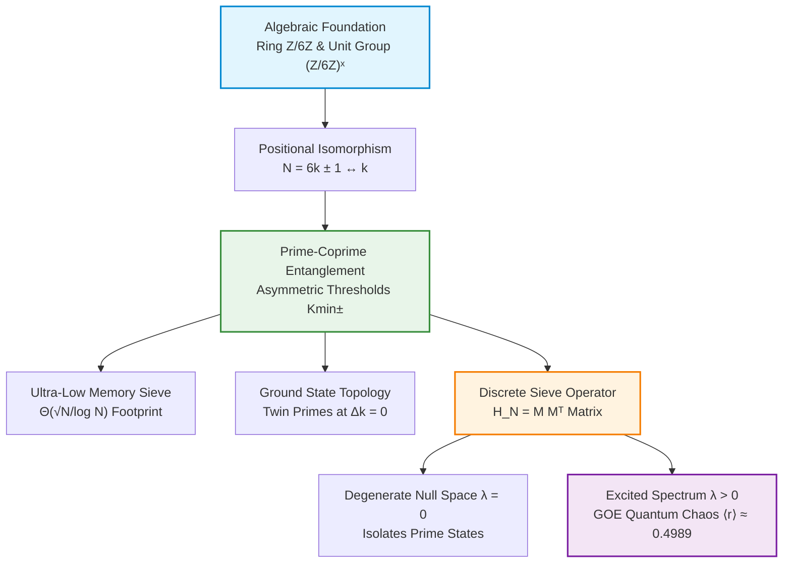

# 🌀 Modular Projection Sieve

### Sublinear Memory Prime Sieving via $\mathbb{Z}/6\mathbb{Z}$ Projection, $K_{\min}\pm$ Chiral Entanglement, and GOE Quantum Spectroscopy

[](https://colab.research.google.com/github/NachoPeinador/modular-projection-sieve/blob/main/Notebooks/Experimental_Validation_Complete.ipynb)
[](https://colab.research.google.com/github/NachoPeinador/modular-projection-sieve/blob/main/Notebooks/Formal_Verification_Lean4.ipynb)
[](https://www.python.org/)
[](https://opensource.org/licenses/MIT)
[](https://doi.org/10.5281/zenodo.22043294)
[](https://orcid.org/0009-0008-1822-3452)
[](https://github.com/NachoPeinador/modular-projection-sieve/blob/main/Papers/Modular_Projection_Sieve_EN.pdf)

---

## 🎯 TL;DR – The Essentials

### 🔬 **Theoretical Core**

* 🧩 **Modular Projection over $(\mathbb{Z}/6\mathbb{Z})^\times$:** Reframes prime numbers $p > 3$ as positional indices $k$ in dual chiral channels ($6k \pm 1$), eliminating $66.67\%$ of the integer search space passively without memory allocation.
* ⚛️ **Prime-Coprime Entanglement ($K_{\min}\pm$):** Reveals that prime integers in $(\mathbb{Z}/6\mathbb{Z})^\times$ form conjugated pairs that deterministically dictate composite generation thresholds. The ground state ($\Delta k = 0$) corresponds geometrically to twin prime pairs.
* 🌌 **Discrete Quantum Chaos (GOE):** Matrix representation of the sieve operator $\mathbf{H}_N = MM^T$ exhibits a degenerate null-space ($99.99\%$ dimension collapse isolating primes) and excited level repulsion ($\langle r \rangle \approx 0.4989$) belonging to the **Gaussian Orthogonal Ensemble (GOE)**.

### ⚡ **Computational Benchmarks**

* 💾 **Ultra-Low Memory Footprint:** Operates under a deterministic spatial complexity of $\Theta(\sqrt{N}/\log N)$. Requires merely **$53.1$ KB** of working RAM for $N=10^9$ (over $2,240\times$ less memory than the classical Sieve of Eratosthenes).
* 🎯 **Deterministic Accuracy:** $0.0\%$ error rate up to $N=10^9$, reproducing the exact count of $\pi(10^9) = 50,847,534$ primes.
* 🔒 **Axiom-Free Certification:** The positional isomorphism, $K_{\min}\pm$ thresholds, and strict matrix self-adjointness ($\mathbf{H}_N^\dagger = \mathbf{H}_N$) are mechanistically verified without omitted axioms (`sorry-free`) in **Lean 4**.

---

## 🔍 Research Overview

The distribution of prime numbers is traditionally studied either via multiplicative algorithms (such as the Sieve of Eratosthenes) or through the zeros of the Riemann zeta function. 

This repository introduces an **Algebraic Theory of Modular Projection Sieving** that bridges number theory, discrete harmonic analysis, and random matrix theory (RMT):

1. **Positional Index Isomorphism:** By projecting $\mathbb{N}$ onto the unit group $(\mathbb{Z}/6\mathbb{Z})^\times = \{1, 5\}$, divisibility $p \mid N$ translates into a topological lattice-avoidance problem over discrete indices $k \in \mathbb{N}^+$.
2. **Hardware-Friendly Architecture:** Because primality is evaluated on-demand without maintaining a boolean marking array of size $N$, the working state requires only storing base prime tuples up to $\sqrt{N}$. This provides an optimal solution for embedded hardware, IoT devices, and lightweight cryptography.
3. **Discrete Hilbert-Pólya Analogue:** While the continuous zeros of $\zeta(s)$ obey Gaussian Unitary Ensemble (GUE) statistics, our real-symmetric discrete sieve operator $\mathbf{H}_N$ serves as a real-valued, time-reversal symmetric quantum analogue governed by the Gaussian Orthogonal Ensemble (GOE).

---

## 🧭 Conceptual Architecture



---

## 📊 Performance & Complexity Comparison

The table below positions the Modular Projection Sieve within the classical time-space trade-off hierarchy:

| Algorithm | Working Memory | Time Complexity | Logical Complexity | Ideal Use Case |
| --- | --- | --- | --- | --- |
| **Classical Eratosthenes** | $O(N)$ | $O(N \log \log N)$ | Minimal | Large RAM Workstations |
| **Segmented Sieve** | $O(\sqrt{N} + S)$ | $O(N \log \log N)$ | Medium | High-Speed CPU Slicing |
| **Sorenson Compact Sieve** | $O(\sqrt{N})$ | $O(N)$ | High | Algorithmic Optimization |
| **Modular Projection (This Work)** | $\mathbf{\Theta(\sqrt{N}/\log N)}$ | $\mathbf{O(N^{3/2}/\log N)}$ | **Low (Ultra-Light)** | **IoT, Embedded & Smartcards** |
| **Sieve of Atkin** | $O(N^{1/2+\epsilon})$ | $O(N/\log \log N)$ | Very High | Theoretical Upper Bounds |

---

## 🚀 Interactive Computational Laboratory

To guarantee 100% open-science reproducibility, the experimental validation and mathematical proofs are organized into interactive, cloud-ready Jupyter Notebooks:

### 1. Algorithmic Execution & Scaling Benchmarks

* **Exact Prime Counting:** High-performance JIT-compiled (Numba) implementation reproducing exact $\pi(N)$ values up to $N=10^9$.
* **Memory & Time Audit:** Empirical verification of the $53.1$ KB memory footprint and superlinear execution scaling.
* **Chiral Symmetry:** Convergence tracking of the channel ratio $c_1/c_5 \to 1.0000$.

### 2. Quantum Spectroscopy & GOE Level Repulsion

* **Matrix Construction:** Generation of the incidence matrix $M$ and Hamiltonian $\mathbf{H}_N = MM^T$ up to $10^7$ states.
* **Null-Space Collapse:** Dimensional analysis showing $99.99\%$ null-space degeneracy isolating prime numbers.
* **GOE Fluctuation Statistics:** Spectral level spacing ratio evaluation ($\langle r \rangle \approx 0.4989$, median $r_{\text{med}} \approx 0.4983$).

### 3. Lean 4 Formal Verification Suite

* **Axiom-Free Proofs:** Machine-certified proofs in Lean 4 without `sorry` axioms.
* **Core Results Verified:** Theorem of modular classification, positional isomorphism, $K_{\min}\pm$ algebraic thresholds, operator self-adjointness, and twin prime ground-state factorization.

---

## 📁 Repository Structure

```text
## 📁 Repository Structure

```text
modular-projection-sieve/
├── 📂 Papers/                                                  # Academic Manuscripts & LaTeX Source
│   ├── 📄 Modular_Projection_Sieve_EN.pdf                      # Full English Paper (PDF)
│   ├── 📄 Modular_Projection_Sieve_ES.pdf                      # Full Spanish Paper (PDF)
│   └── 📝 Main_Manuscript.tex                                 # LaTeX Source Code
│
├── 📂 Notebooks/                                               # Master Experimental & Verification Lab
│   ├── 📓 Algebraic_Theory_of_Modular_Projection_Sieving.ipynb # Full English Master Notebook (Python + GOE + Lean 4)
│   ├── 📄 Algebraic_Theory_of_Modular_Projection_Sieving.pdf   # Complete PDF Print of English Execution
│   ├── 📓 Teoría_Algebraica_de_Cribado_por_Proyección_Modular.ipynb # Full Spanish Master Notebook
│   ├── 📄 Teoría_Algebraica_de_Cribado_por_Proyección_Modular.pdf   # Complete PDF Print of Spanish Execution
│   └── 📄 primes_audit_k100000_sample.txt                       # Execution audit sample
│
├── 📂 Images/                                                  # Generated High-Resolution Figures
│   ├── 📊 ground_state_spectrum.png                            # Twin prime ground-state spectrum (Δk=0)
│   ├── 📈 asymptotic_evolution_cramer.png                      # Topological gap evolution & Cramér bound
│   └── 📉 goe_spectroscopy_staircase.png                       # GOE level repulsion & spectral staircase
│
├── 📂 Lean/                                                    # Formal Proof Project (Lean 4 / Mathlib)
│   ├── 📄 lean-toolchain                                       # Fixed Lean 4 compiler version
│   ├── 📄 lakefile.toml                                        # Lake build configuration
│   ├── 📄 lake-manifest.json                                   # Frozen Mathlib dependency manifest
│   ├── 📄 Entanglement.lean                                    # Core entanglement theory proof module
│   ├── 📄 Full_Validation.lean                                 # Full axiom-free certification suite
│   └── 📂 Entanglement/                                        # Auxiliary proof submodules
│
├── 📜 .gitignore                                               # Git ignore rules (.pkl.gz, build caches)
├── 📜 LICENSE                                                  # MIT License
└── 📜 README.md                                                # Main Repository Documentation

```

---

## ⚖️ License

This repository is released under the **[MIT License](https://www.google.com/search?q=LICENSE)**.

*You are free to use, modify, distribute, and integrate this software and formal proofs for academic, personal, or commercial applications, provided credit is given to the original author.*

---

## 📝 Citation

If this modular projection framework, the $K_{\min}\pm$ entanglement formulation, or the Lean 4 formal proofs assist in your research, please cite:

**BibTeX:**

```bibtex
@misc{peinador2026modular,
  author       = {Peinador Sala, José Ignacio},
  title        = {Algebraic Theory of Modular Projection Sieving: Structural Isomorphisms and Spectral Connections in Prime Distribution},
  year         = {2026},
  publisher    = {Zenodo},
  doi          = {10.5281/zenodo.22043294},
  url          = {[https://github.com/NachoPeinador/modular-projection-sieve](https://github.com/NachoPeinador/modular-projection-sieve)}
}

```

**APA:**

> Peinador Sala, J. I. (2026). *Algebraic Theory of Modular Projection Sieving: Structural Isomorphisms and Spectral Connections in Prime Distribution*. Zenodo. https://doi.org/10.5281/zenodo.22043294

---

## 🔭 Philosophical Context

> *“Simplicity is not a luxury, but the fundamental footprint of deep order.”*

For centuries, the distribution of prime numbers has been viewed through the lens of irreducible randomness, prompting mathematicians to deploy increasingly heavy analytic machinery or brute-force memory arrays. This research emerged from a fundamentally different question: *What if the apparent chaos of primes is an optical illusion born from observing them in an unnatural coordinate system?*

What began as an inquiry into memory compression for resource-constrained hardware unveiled a deeper algebraic reality. The ring $\mathbb{Z}/6\mathbb{Z}$ is not a mere programming trick or a heuristic wheel—it is a noiseless informational channel. By projecting multiplication into a discrete positional space, the prime distribution ceases to behave as isolated noise. Instead, it reveals itself as a self-organizing, chiral network of $K_{\min}\pm$ entanglements, where twin primes emerge naturally as the geometric ground state ($\Delta k = 0$) and the sieve operator’s spectrum naturally couples to the universal statistics of quantum chaos ($\text{GOE}$).

This project was conceived and developed entirely outside traditional academic institutions. It stands as a reminder that the frontiers of theoretical physics, computer science, and pure mathematics are open to anyone equipped with unconditioned curiosity, rigorous empirical methodology, and the courage to listen when the integers reveal their underlying geometry.

---

> 🌌 **The Arithmetic Universe / El Universo Aritmético**
> 🇬🇧 *This research is part of the theoretical framework of **The Arithmetic Universe**, which postulates that fundamental reality is not hidden in infinite chaos, but in the elegant architecture of integers.* 🔗 **[Explore the central hub & theory here](https://github.com/NachoPeinador/EL_UNIVERSO_ARITMETICO)**.

```

***

### 💡 Consejos de entorno GitHub que marcarán la diferencia:

1. **Subir los PDFs compilados:** Guarda las versiones compiladas de los artículos en la carpeta `Papers/` (`Modular_Projection_Sieve_EN.pdf` y `Modular_Projection_Sieve_ES.pdf`). Los visitantes de GitHub valoran mucho poder abrir el PDF directamente en el navegador.
2. **Archivos de Lean 4:** Coloca los archivos nativos de Lean en una carpeta `Lean/` (`lakefile.lean` y `ModularSieve.lean`). Así, cualquier desarrollador de Lean podrá clonar el repo y ejecutar `lake build` en su máquina local.
3. **Sección "Social Preview" de GitHub:** En los ajustes de tu repositorio (*Settings -> General -> Social preview*), puedes subir una imagen del diagrama de la arquitectura o del gráfico de la matriz de criba. Esto hará que cuando compartas el enlace en redes (como X/Twitter o LinkedIn) aparezca una tarjeta visual impactante.

```
