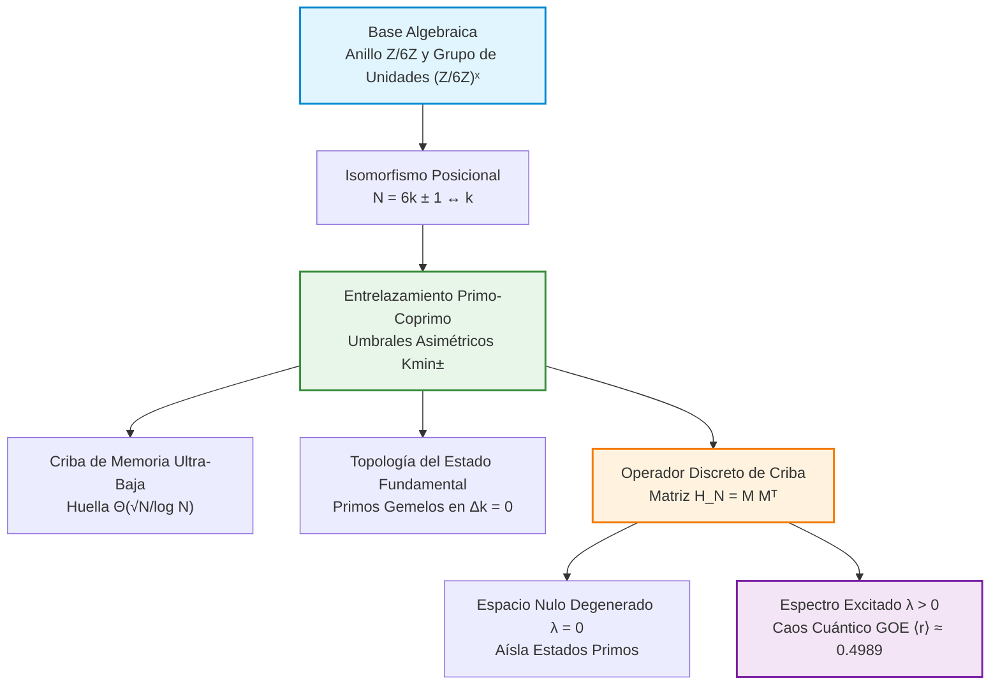

# 🌀 Criba por Proyección Modular

### Cribado de Primos con Memoria Sublineal mediante Proyección sobre $\mathbb{Z}/6\mathbb{Z}$, Entrelazamiento Quiral $K_{\min}\pm$ y Espectroscopía Cuántica GOE

[](https://colab.research.google.com/github/NachoPeinador/modular-projection-sieve/blob/main/Notebooks/Teoría_Algebraica_de_Cribado_por_Proyección_Modular.ipynb)
[](https://colab.research.google.com/github/NachoPeinador/modular-projection-sieve/blob/main/Notebooks/Teoría_Algebraica_de_Cribado_por_Proyección_Modular.ipynb)
[](https://www.python.org/)
[](https://opensource.org/licenses/MIT)
[](https://doi.org/10.5281/zenodo.22043294)
[](https://orcid.org/0009-0008-1822-3452)
[](https://github.com/NachoPeinador/modular-projection-sieve/blob/main/Papers/TAC_por_Proyeccion_Modular.pdf)

---

## 🎯 TL;DR – Los Esenciales

### 🔬 **Núcleo Teórico**

* 🧩 **Proyección Modular sobre $(\mathbb{Z}/6\mathbb{Z})^\times$:** Reinterpreta los números primos $p > 3$ como índices posicionales $k$ en dos canales quirales ($6k \pm 1$), eliminando de forma pasiva el $66.67\%$ del espacio de búsqueda entero sin asignación de memoria.
* ⚛️ **Entrelazamiento Primo-Coprimo ($K_{\min}\pm$):** Revela que los enteros primos en $(\mathbb{Z}/6\mathbb{Z})^\times$ forman pares conjugados que determinan de manera determinista los umbrales de generación de compuestos. El estado fundamental ($\Delta k = 0$) corresponde geométricamente a pares de primos gemelos.
* 🌌 **Caos Cuántico Discreto (GOE):** La representación matricial del operador de criba $\mathbf{H}_N = MM^T$ exhibe un espacio nulo degenerado (colapso dimensional del $99.99\%$ que aísla los primos) y repulsión de niveles excitados ($\langle r \rangle \approx 0.4989$) perteneciente al **Ensamble Ortogonal Gaussiano (GOE)**.

### ⚡ **Marcas de Rendimiento Computacional**

* 💾 **Huella de Memoria Ultra-Reducida:** Opera bajo una complejidad espacial determinista de $\Theta(\sqrt{N}/\log N)$. Requiere apenas **$53.1$ KB** de RAM de trabajo para $N=10^9$ (más de $2\,240\times$ menos memoria que la Criba de Eratóstenes clásica).
* 🎯 **Exactitud Determinista:** Tasa de error del $0.0\%$ hasta $N=10^9$, reproduciendo el conteo exacto de $\pi(10^9) = 50\,847\,534$ primos.
* 🔒 **Certificación Libre de Axiomas:** El isomorfismo posicional, los umbrales $K_{\min}\pm$ y la autoadjuntidad matricial estricta ($\mathbf{H}_N^\dagger = \mathbf{H}_N$) están verificados mecanizadamente sin axiomas omitidos (`sorry-free`) en **Lean 4**.

---

## 🔍 Visión General de la Investigación

La distribución de los números primos se estudia tradicionalmente mediante algoritmos multiplicativos (como la Criba de Eratóstenes) o a través de los ceros de la función zeta de Riemann.

Este repositorio introduce una **Teoría Algebraica de Cribado por Proyección Modular** que conecta la teoría de números, el análisis armónico discreto y la teoría de matrices aleatorias (RMT):

1. **Isomorfismo Posicional de Índices:** Al proyectar $\mathbb{N}$ sobre el grupo de unidades $(\mathbb{Z}/6\mathbb{Z})^\times = \{1, 5\}$, la divisibilidad $p \mid N$ se traduce en un problema topológico de evasión de redes sobre índices discretos $k \in \mathbb{N}^+$.
2. **Arquitectura Apta para Hardware Restringido:** Dado que la primalidad se evalúa bajo demanda sin mantener un vector booleano de marcado de tamaño $N$, el estado de trabajo solo requiere almacenar tuplas de primos base hasta $\sqrt{N}$. Esto proporciona una solución óptima para sistemas embebidos, dispositivos IoT y criptografía ligera.
3. **Análogo Discreto de Hilbert-Pólya:** Mientras que los ceros continuos de $\zeta(s)$ obedecen estadísticas del Ensamble Unitario Gaussiano (GUE), nuestro operador discreto de criba real y simétrico $\mathbf{H}_N$ actúa como un análogo cuántico real con simetría de inversión temporal gobernado por el Ensamble Ortogonal Gaussiano (GOE).

---

## 🧭 Arquitectura Conceptual



---

## 📊 Comparativa de Rendimiento y Complejidad

La siguiente tabla ubica la Criba por Proyección Modular dentro de la jerarquía clásica de compensación tiempo-espacio:

| Algoritmo | Memoria de Trabajo | Complejidad Temporal | Complejidad Lógica | Caso de Uso Ideal |
| --- | --- | --- | --- | --- |
| **Criba de Eratóstenes Clásica** | $O(N)$ | $O(N \log \log N)$ | Mínima | Estaciones de Trabajo con Alta RAM |
| **Criba Segmentada** | $O(\sqrt{N} + S)$ | $O(N \log \log N)$ | Media | Segmentación de Alta Velocidad en CPU |
| **Criba Compacta (Sorenson)** | $O(\sqrt{N})$ | $O(N)$ | Alta | Optimización Algorítmica |
| **Proyección Modular (Este Trabajo)** | $\mathbf{\Theta(\sqrt{N}/\log N)}$ | $\mathbf{O(N^{3/2}/\log N)}$ | **Baja (Ultraligera)** | **IoT, Embebidos y Smartcards** |
| **Criba de Atkin** | $O(N^{1/2+\epsilon})$ | $O(N/\log \log N)$ | Muy Alta | Cotas Teóricas Superiores |

---

## 🚀 Reproducibilidad: Laboratorio Computacional Interactivo

Para garantizar una reproducibilidad del 100% bajo los estándares de Ciencia Abierta, la auditoría empírica completa y la suite de demostraciones formales se proporcionan en un cuaderno maestro integral todo en uno. Puedes ejecutar todos los experimentos, certificar los fundamentos matemáticos, generar las figuras y verificar las afirmaciones directamente en tu navegador:

[](https://colab.research.google.com/github/NachoPeinador/modular-projection-sieve/blob/main/Notebooks/Teoría_Algebraica_de_Cribado_por_Proyección_Modular.ipynb)

### 🛠️ Flujo de Validación Experimental (Python / Numba)

El cuaderno ejecuta un flujo de verificación empírica en 7 fases mapeado directamente con los teoremas, tablas y secciones del artículo:

* **Fase 0 — Auditoría Lógica y Exactitud Absoluta:** Implementación de referencia en Python puro verificada frente a la Criba de Eratóstenes para garantizar una tasa de error del $0.0\%$ y certificar la topología de entrelazamiento gemelo.
* **Fase 1 — Entrelazamiento $K_{\min}\pm$ (Teoremas 3.5 y 4.10):** Implementación estricta de las fórmulas de umbral específicas por canal basadas en la teoría de coprimidad posicional (`NextKop`).
* **Fase 2 — Exactitud en el Conteo Absoluto (Teoremas 6.2 y 6.3):** Generación del conteo exacto para la función $\pi(N)$ hasta $N=10^9$ sin falsos positivos ni negativos, validando la **Tabla 6.1**.
* **Fase 3 — Complejidad Espacial $\Theta(\sqrt{N}/\log N)$ (Teorema 5.1):** Demostración empírica del colapso de la memoria de trabajo ($53.1\text{ KB}$ en $N=10^9$), reproduciendo la **Tabla 6.2**.
* **Fase 4 — Escalado de Complejidad Temporal (Teoremas 5.3 y 6.4):** Análisis de las razones de salto asintótico $O(N^{1.5}/\log N)$, validando la **Tabla 6.3**.
* **Fase 5 — Simetría Quiral Entrelazada (Proposición 6.5):** Confirmación empírica de que la razón de canales $c_1/c_5$ entre primos de la forma $6k+1$ y $6k-1$ converge estrictamente a $1.0000$.
* **Fase 6 — Espectroscopía GOE y Análogo de Hilbert-Pólya (Sección 6.7 y Teorema 4.7):** Construcción y diagonalización exacta del Hamiltoniano autoadjunto discreto $\mathbf{H}\_N = M M^T$ (hasta $10^7$ estados), confirmando un 99.9902% de degeneración en el espacio nulo ($\lambda = 0$) que aísla los números primos y repulsión de niveles cuánticos GOE ($\langle r\_i \rangle \approx 0.4989$, mediana $r_{\text{med}} \approx 0.4983$).

---

### 🛡️ Módulo de Verificación Formal (Lean 4)

El artículo fundamenta la exactitud absoluta del algoritmo y la topología espectral en pilares matemáticos certificados formalmente en el asistente de demostraciones **Lean 4** sin axiomas omitidos (`sorry-free`):

1. **Teorema 2.1 y Lema 3.1:** Clasificación modular sobre $(\mathbb{Z}/6\mathbb{Z})^\times$ e isomorfismo de índices posicionales.
2. **Teoremas 3.5 y 3.7:** Cálculo de umbrales y exactitud del entrelazamiento primo-coprimo.
3. **Teorema 4.1 (Núcleo Algebraico de $\mathbb{Z}/6\mathbb{Z}$):** Involución modular e isomorfismo estricto del grupo de unidades.
4. **Teorema 4.3:** Colapso topológico del Aniquilador Espectral.
5. **Autoadjuntidad (Teorema Espectral):** Simetría estructural de $\mathbf{H}\_N = M M^T$, demostrando que los niveles de energía son observables estrictamente reales ($\sigma(\mathbf{H}\_N) \subset \mathbb{R}\_{\ge 0}$).
6. **Corolario 7.2 (Estado Fundamental de Primos Gemelos):** Colisión exacta de entrelazamiento en el estado fundamental ($\Delta k = 0$), demostrando que las interacciones de primos gemelos colapsan en el índice ultra-simétrico $k = 6k_p^2$.
   
---

## 📁 Estructura del Repositorio

```text
modular-projection-sieve/
├── 📂 Papers/                                                  # Manuscritos Académicos y Fuente LaTeX
│   ├── 📄 Modular_Projection_Sieve_EN.pdf                      # Artículo Completo en Inglés (PDF)
│   ├── 📄 Modular_Projection_Sieve_ES.pdf                      # Artículo Completo en Español (PDF)
│   └── 📝 Main_Manuscript.tex                                 # Código Fuente LaTeX
│
├── 📂 Notebooks/                                               # Laboratorio Maestro de Experimentos y Verificación
│   ├── 📓 Algebraic_Theory_of_Modular_Projection_Sieving.ipynb # Cuaderno Maestro en Inglés (Python + GOE + Lean 4)
│   ├── 📄 Algebraic_Theory_of_Modular_Projection_Sieving.pdf   # Impresión Completa en PDF de la Ejecución en Inglés
│   ├── 📓 Teoría_Algebraica_de_Cribado_por_Proyección_Modular.ipynb # Cuaderno Maestro en Español
│   ├── 📄 Teoría_Algebraica_de_Cribado_por_Proyección_Modular.pdf   # Impresión Completa en PDF de la Ejecución en Español
│   └── 📄 primes_audit_k100000_sample.txt                       # Muestra de Auditoría de Ejecución
│
├── 📂 Images/                                                  # Figuras Generadas en Alta Resolución
│   ├── 📊 ground_state_spectrum.png                            # Espectro del estado fundamental de primos gemelos (Δk=0)
│   ├── 📈 asymptotic_evolution_cramer.png                      # Evolución del salto topológico y cota de Cramér
│   └── 📉 goe_spectroscopy_staircase.png                       # Repulsión de niveles GOE y escalera espectral
│
├── 📂 Lean/                                                    # Proyecto de Demostración Formal (Lean 4 / Mathlib)
│   ├── 📄 lean-toolchain                                       # Versión fijada del compilador Lean 4
│   ├── 📄 lakefile.toml                                        # Configuración de construcción Lake
│   ├── 📄 lake-manifest.json                                   # Registro congelado de dependencias Mathlib
│   ├── 📄 Entanglement.lean                                    # Módulo principal de teoría de entrelazamiento
│   ├── 📄 Full_Validation.lean                                 # Suite de certificación completa libre de axiomas
│   └── 📂 Entanglement/                                        # Submódulos auxiliares de demostración
│
├── 📜 .gitignore                                               # Filtros de exclusión en Git (.pkl.gz, cachés)
├── 📜 LICENSE                                                  # Licencia MIT
└── 📜 README.md                                                # Documentación Principal del Repositorio

```

---

## ⚖️ Licencia

Este repositorio se distribuye bajo los términos de la **[Licencia MIT](https://www.google.com/search?q=LICENSE)**.

*Eres libre de usar, modificar, distribuir e integrar este software y sus demostraciones formales para aplicaciones académicas, personales o comerciales, siempre que se otorgue el crédito correspondiente al autor original.*

---

## 📝 Citación

Si este marco de proyección modular, la formulación de entrelazamiento $K_{\min}\pm$ o las demostraciones en Lean 4 resultan de utilidad para tu investigación, por favor cita este trabajo:

**BibTeX:**

```bibtex
@misc{peinador2026modular,
  author       = {Peinador Sala, José Ignacio},
  title        = {Algebraic Theory of Modular Projection Sieving: Structural Isomorphisms and Spectral Connections in Prime Distribution},
  year         = {2026},
  publisher    = {Zenodo},
  doi          = {10.5281/zenodo.22043294},
  url          = {[https://github.com/NachoPeinador/modular-projection-sieve](https://github.com/NachoPeinador/modular-projection-sieve)}
}

```

**APA:**

> Peinador Sala, J. I. (2026). *Algebraic Theory of Modular Projection Sieving: Structural Isomorphisms and Spectral Connections in Prime Distribution*. Zenodo. https://doi.org/10.5281/zenodo.22043294

---

## 🔭 Contexto Filosófico

> *“La simplicidad no es un lujo, sino la huella fundamental de un orden profundo.”*

Durante siglos, la distribución de los números primos se ha considerado bajo el prisma de un azar irreductible, lo que ha llevado a la matemática a desplegar una maquinaria analítica cada vez más pesada o arreglos de memoria por fuerza bruta. Esta investigación surgió de una pregunta profundamente distinta: *¿Y si el caos aparente de los primos es solo una ilusión óptica nacida de observarlos en un sistema de coordenadas no natural?*

Lo que comenzó como una indagación sobre la compresión de memoria para hardware de recursos restringidos reveló una realidad algebraica más profunda. El anillo $\mathbb{Z}/6\mathbb{Z}$ no es un mero truco de programación ni una rueda heurística: es un canal informacional sin ruido. Al proyectar la multiplicatividad en un espacio posicional discreto, la distribución de los primos deja de comportarse como ruido aislado. En su lugar, se revela como una red quiral autoorganizada de entrelazamientos $K_{\min}\pm$, donde los primos gemelos emergen de forma natural como el estado fundamental geométrico ($\Delta k = 0$) y el espectro del operador de criba se acopla de manera limpia a las estadísticas universales del caos cuántico ($\text{GOE}$).

Este proyecto fue concebido y desarrollado íntegramente fuera del ecosistema académico institucional. Permanece como un recordatorio de que las fronteras de la física teórica, la informática y la matemática pura están abiertas para cualquiera que disponga de una curiosidad sin prejuicios, una metodología empírica rigurosa y el valor de escuchar cuando los números enteros revelan su geometría subyacente.

---

> 🌌 **El Universo Aritmético / The Arithmetic Universe**
> 🇪🇸 *Esta investigación forma parte del marco teórico de **El Universo Aritmético**, el cual postula que la realidad fundamental no se esconde en el caos infinito, sino en la elegante arquitectura de los números enteros.* 🔗 **[Explora el repositorio central y la teoría aquí](https://github.com/NachoPeinador/EL_UNIVERSO_ARITMETICO)**.

```

```
